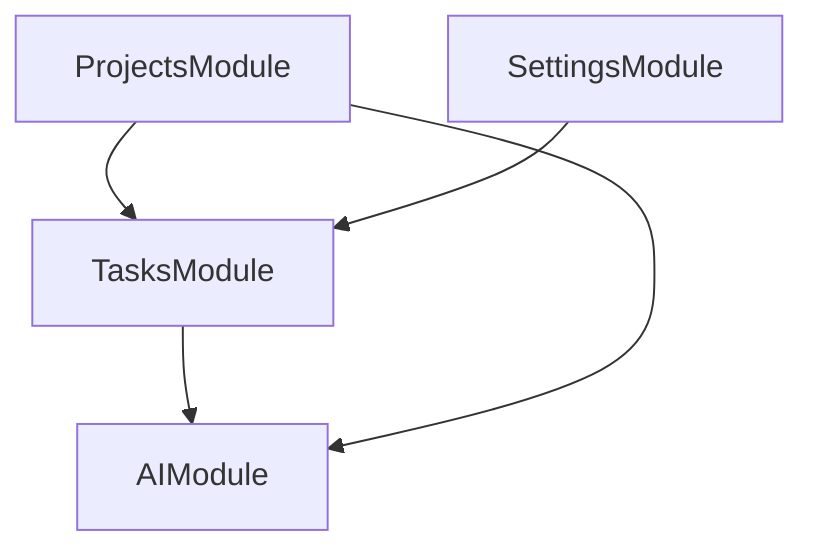

# SecondBrain Backend Architecture Overview

## Visão Geral

O SecondBrain é uma plataforma de gestão inteligente de projetos e tarefas orientada a resultados e rastreabilidade estratégica.

## Estrutura de Módulos (NestJS)

- **`ProjectsModule`**: Gestão macro de projetos, WBS (Work Breakdown Structure), Matriz X e Planejamento em Ondas (Rolling Wave).
- **`TasksModule`**: Gestão micro de tarefas, estimativas PERT, métricas EVM, inferência de dependências (CPM), kanban e checklists IA.
- **`AIModule`**: Integrações com Google Gemini para suporte estocástico, geração de WBS, sugestões de micro-tarefas e RAG via Wiki.
- **`SettingsModule`**: Configurações de preferências do usuário e notificações.

## Grafo de Relacionamento de Módulos

