# `tasks/services/intelligence/` — Guia de Referência

## Visão Geral

A pasta `intelligence/` concentra os serviços responsáveis pela **camada de IA do sistema de tarefas**: geração de sugestões de tarefas via Gemini, geração e gerenciamento de checklists inteligentes com histórico, e geração de feedback de conclusão (catchball).

Cada serviço orquestra chamadas ao `GeminiService` com lógica de retry, fallback e parsing seguro de JSON.

### Fluxos da Camada de Inteligência e IA

```mermaid
graph TD
    subgraph SugestoesLoop [Loop de Sugestões de Tarefas por Horas-Meta]
        A["Requisição: targetHours"] --> B["Carregar Tarefas Existentes"]
        B --> C["Calcular remainingHours"]
        C --> D{"currentHours < remainingHours?"}
        D -- Sim --> E["Gemini: generateTaskSuggestions chunkHours=8"]
        E --> F["Parsing Seguro JSON + Deduplicação por Nome"]
        F --> G["Acumular Sugestões & Emitir Progresso"]
        G --> D
        D -- Não / Limite Atingido --> H["Retornar AiSuggestionsResponseDto"]
    end

    subgraph ChecklistHistorico [Geração de Checklist com Contexto Histórico]
        I["Solicitar Checklist"] --> J["ChecklistService: findSimilarTasksInProject"]
        J --> K{"Encontrou tarefas similares nos últimos 30 dias?"}
        K -- Sim --> L["Enrich historicalContext"]
        L --> M["Gemini: generateChecklistWithHistory"]
        K -- Não --> N["Gemini: generateChecklistForTask"]
        M & N --> O["Validar Checklist: Mínimo 3, Máximo 10 itens"]
        O --> P["Retornar Checklist Estruturado"]
    end

    subgraph FeedbackConclusao [Fluxo de Catchball e Completion Feedback]
        Q["Conclusão de Tarefa"] --> R["FeedbackService: generateCompletionFeedback"]
        R --> S{"Possui payload do usuário?"}
        S -- Sim --> T["Persistir feedback diretamente"]
        S -- Não --> U["Gemini: generateFeedbackOnCompletion"]
        U --> V["Construir JSON: celebration, validation, question, suggestion"]
        V --> W["Persistir no banco e sugerir 3 Próximos Passos"]
    end
```



---

## Estrutura de Arquivos

```
intelligence/
├── index.ts                    # Barrel export dos serviços
├── ai-suggestions.service.ts   # TasksAiSuggestionsService — geração iterativa de tarefas via IA
├── checklist.service.ts        # ChecklistService + TasksChecklistService — checklists e validação
└── feedback.service.ts         # FeedbackService — feedback de conclusão e próximos passos
```

---

## Serviços

### `TasksAiSuggestionsService` — `ai-suggestions.service.ts`

Gera sugestões de tarefas para um projeto usando o Gemini, com suporte a **geração iterativa** até atingir uma meta de horas e **streaming de progresso**.

**Métodos públicos:**

| Método | Descrição |
|--------|-----------|
| `generateAiSuggestionsWithProgress(dto, onProgress, onComplete, onError)` | Gera sugestões em background. Chama `onProgress` a cada iteração, `onComplete` ao finalizar e `onError` em caso de falha. |
| `generateAiSuggestions(dto)` | Versão síncrona sem callbacks. Retorna `AiSuggestionsResponseDto`. |

**Fluxo de geração (quando `targetHours > 0`):**
```
loadExistingTasks(dto.projectId)         ← conta horas já planejadas + nomes existentes
  remainingHours = targetHours - alreadyPlannedHours
    while currentHours < remainingHours && iteration < 15:
      geminiService.generateTaskSuggestions({ projectName, shortTermGoal, ..., remainingHours: 8 })
        safeParseGeminiJson(response)    ← tenta JSON direto → array nested → regex fallback
          deduplication por nome        ← filtra duplicatas contra existingTaskNames
            acumula allSuggestions
              emitProgress(onProgress)
    return AiSuggestionsResponseDto
```

**Comportamentos especiais:**

| Situação | Comportamento |
|----------|---------------|
| `targetHours ≤ 0` | Geração única sem loop iterativo |
| Projeto já atingiu meta | Retorna `status: 'success'` sem gerar novas tarefas |
| `RATE_LIMIT` do Gemini | Aguarda backoff exponencial (`15s × strike`, máx. `45s`) e retenta |
| Resposta JSON inválida | Usa `generateMockSuggestions` como fallback (3 tarefas genéricas) |
| Erro após sugestões parciais | Retorna as sugestões acumuladas com `status: 'partial'` |
| Limite de 15 iterações | Retorna parcial com mensagem de limite atingido |

**DTOs principais:** `GenerateAiSuggestionsDto`, `AiSuggestionsResponseDto`, `AiSuggestionsProgressDto`, `AiTaskSuggestionDto`.

---

### `ChecklistService` — `checklist.service.ts` (classe auxiliar)

Serviço auxiliar de checklist sem acesso ao Gemini. Concentra a lógica de análise histórica e validação de estrutura.

**Métodos públicos:**

| Método | Descrição |
|--------|-----------|
| `findSimilarTasksInProject(projectId, microTaskType?, limit?)` | Busca tarefas similares concluídas nos últimos 30 dias com checklist preenchido. Filtra por `microTaskType` (`habit`, `complex`, `quick`, `subtask`). |
| `enrichHistoryContext(tasks)` | Formata a lista de tarefas históricas em texto estruturado para inclusão em prompt de IA. |
| `validateChecklistStructure(checklist?)` | Valida que o checklist possui entre 3 e 10 itens, sem itens vazios ou duplicados. |
| `validateChecklistCompletion(checklist?)` | Verifica se 100% dos itens estão marcados como `completed`. |
| `calculateCompletionPercentage(checklist?)` | Retorna o percentual de conclusão (0–100). |

**Regras de validação de estrutura:**
- Mínimo 3 itens, máximo 10 itens
- Nenhum item pode ser string vazia
- Nenhum item duplicado (comparação case-insensitive)
- Aceita itens como `string` ou `{ item: string, completed?: boolean }`

---

### `TasksChecklistService` — `checklist.service.ts` (serviço injetável)

Orquestra ciclo de vida completo dos checklists: persistência, validação de gates de conclusão e geração via IA com enriquecimento histórico.

**Métodos públicos:**

| Método | Descrição |
|--------|-----------|
| `validateChecklistStructure(checklist?)` | Delega para `ChecklistService.validateChecklistStructure`. |
| `updateMicroTaskChecklist(id, checklist)` | Normaliza e persiste o checklist via `TasksInputService.normalizeChecklist`. |
| `updateChecklistItem(taskId, itemIndex, completed)` | Atualiza o campo `completed` de um item por índice. Retorna a tarefa com `completionPercentage`. |
| `validateCompletionRequirements(taskId)` | Quality gate: verifica se todos os itens do checklist estão concluídos. |
| `getValidationErrors(taskId)` | Retorna lista de erros: checklist incompleto e PERT ausente (ignora tarefas de tipo `habit`). |
| `generateChecklistForTask(params)` | Geração simples via Gemini sem histórico. |
| `generateChecklistWithHistory(params)` | Geração enriquecida: busca tarefas similares → monta contexto histórico → envia para Gemini com histórico. |

**Fluxo de `generateChecklistWithHistory`:**
```
checklistService.findSimilarTasksInProject(projectId, microTaskType)
  checklistService.enrichHistoryContext(similarTasks)     ← formata texto do histórico
    if historicalContext:
      geminiService.generateChecklistWithHistory({ taskName, description, microTaskType, historicalContext })     ← prompt enriquecido
    else:
      geminiService.generateChecklistForTask({ taskName, description, microTaskType })         ← prompt simples
```

**Tipo `ChecklistHistoryProjectRef`:** aceita `string`, `Types.ObjectId` ou `{ _id: string | ObjectId }`.

---

### `FeedbackService` — `feedback.service.ts`

Gera e persiste **feedback de conclusão** (catchball) para tarefas concluídas, usando o Gemini para produzir texto estruturado em JSON com celebração, validação, pergunta e sugestão.

**Métodos públicos:**

| Método | Descrição |
|--------|-----------|
| `generateCompletionFeedback(id, payload?)` | Gera ou registra feedback. Se `payload` contiver chaves de feedback do usuário, persiste direto. Caso contrário, chama o Gemini. |
| `getCompletionFeedback(id)` | Recupera o último feedback gerado para a tarefa (ordenado por `createdAt desc`). |
| `generateFeedbackOnCompletion(task, checklist?, timeSpentMinutes?)` | Gera o JSON de feedback via Gemini e persiste no modelo `TaskCompletionFeedback`. |
| `suggestNextSteps(task, feedback)` | Gera 3 próximos passos acionáveis com base no feedback (array `{ title, description }`). |

**Estrutura do feedback gerado:**
```json
{
  "celebration": "Parabéns por concluir a tarefa!",
  "validation":  "Checklist 80% completo. Entrega atende critérios.",
  "question":    "Houve algum impedimento durante a execução?",
  "suggestion":  "Revisar itens não concluídos e planejar próximo passo (PDCA)."
}
```

**Fluxo de `generateCompletionFeedback`:**
```
validateId(id) → getTask() → assertIsConcluded()
  if isUserFeedbackPayload(payload):
    feedbackModel.create({ modelName: 'user-feedback', feedback: JSON.stringify(payload) })
  else:
    generateFeedbackOnCompletion(task, checklist, pomodorosDid*25)
      geminiService.generateContent(prompt, { responseMimeType: 'application/json' })
        safeParseJson(raw)         ← remove markdown fences + extrai objeto JSON
          feedbackModel.create()   ← persiste com modelName, promptVersion, inputSnapshot
```

**Persistência:** todos os feedbacks são salvos no schema `TaskCompletionFeedback` com `promptVersion: 'catchball-v1'` e um `inputSnapshot` para auditoria e rastreabilidade.

---

## Dependências Externas

```
intelligence/
├── GeminiService          (ai/) — generateTaskSuggestions, generateChecklistForTask,
│                                  generateChecklistWithHistory, generateContent
├── TasksInputService      (workflow/) — normalizeChecklist
├── Task (schema)          — consulta de tarefas existentes e histórico
└── TaskCompletionFeedback (schema) — persistência de feedbacks gerados
```

---

## Padrões de Injeção

```
TasksAiSuggestionsService
  ├── Task (model)          ← busca tarefas existentes do projeto
  └── GeminiService         ← geração de sugestões

TasksChecklistService
  ├── Task (model)          ← leitura e atualização de checklists
  ├── ChecklistService      ← validação e análise histórica
  ├── TasksInputService     ← normalização de checklist
  └── GeminiService         ← geração de checklist via IA

FeedbackService
  ├── GeminiService         ← geração de feedback em JSON
  ├── Task (model)          ← leitura da tarefa concluída
  └── TaskCompletionFeedback (model) ← persistência de feedback
```

---

## Pontos de Atenção

- **Rate limiting do Gemini em `TasksAiSuggestionsService`**: o loop usa `await setTimeout(3000ms)` entre iterações e backoff de até `45s` em caso de `RATE_LIMIT`. Nunca paralelizar as chamadas.
- **Parsing defensivo de JSON**: tanto `safeParseGeminiJson` quanto `safeParseJson` implementam múltiplas estratégias de fallback (JSON direto → array aninhado → regex). Nunca assuma que a resposta do Gemini é JSON válido direto.
- **Feedback só para tarefas concluídas**: `generateCompletionFeedback` lança `BadRequestException` se `task.isConcluded` for falso.
- **Histórico de similaridade é por `microTaskType`**: `findSimilarTasksInProject` retorna lista vazia se `microTaskType` não for um dos valores válidos (`habit`, `complex`, `quick`, `subtask`).
- **`getValidationErrors` ignora habits**: tarefas com `microTaskType === 'habit'`, `parentRecurringId` ou `recurringRule` são excluídas das validações de checklist e PERT — hábitos recorrentes têm fluxo próprio.
