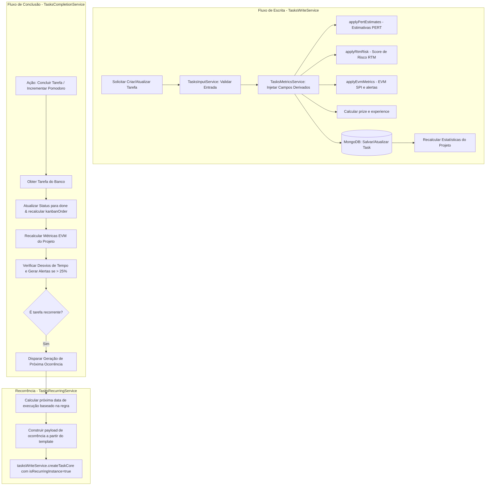

# `tasks/services/workflow/` — Guia de Referência

## Visão Geral

A pasta `workflow/` concentra os serviços responsáveis pelo **ciclo de vida operacional das tarefas**: criação, atualização, exclusão, conclusão, movimentação no Kanban e recorrência.

Cada serviço tem uma responsabilidade única e bem definida. A comunicação entre eles é feita por injeção de dependência padrão do NestJS, com exceção de casos que exigem `forwardRef` para evitar ciclos.

### Ciclo de Vida Operacional das Tarefas



---

## Estrutura de Arquivos

```
workflow/
├── index.ts                         # Barrel export dos serviços
├── write.service.ts                 # TasksWriteService   — criação, atualização, exclusão
├── completion.service.ts            # TasksCompletionService — conclusão, pomodoros, kanban
├── recurring.service.ts             # TasksRecurringService — regras e séries de recorrência
├── input.service.ts                 # TasksInputService   — validação e normalização de entrada
├── kanban.utils.ts                  # Helper puro: resolução de targetOrder
├── recurring.utils.ts               # Re-exports das utils de recorrência
├── recurring-calculation.utils.ts   # Cálculo de próxima data de ocorrência
├── recurring-exception.utils.ts     # Tratamento de exceções em regras de recorrência
└── recurring-validation.utils.ts    # Validação de RecurringRuleDto
```

---

## Serviços

### `TasksWriteService` — `write.service.ts`

Responsável por todas as operações de **escrita** no banco de dados de tarefas.

**Métodos públicos:**

| Método | Descrição |
|--------|-----------|
| `createTaskCore(dto)` | Persiste uma tarefa após resolver o projeto e aplicar campos derivados. Recalcula estatísticas do projeto. |
| `createMicroTask(dto)` | Cria uma micro-tarefa com geração opcional de checklist via IA. Valida a estrutura do checklist. |
| `createMany(dtos, options?)` | Insere múltiplas tarefas em batch (`insertMany`). Suporta resolução de projeto e recálculo de stats. |
| `update(id, dto)` | Atualiza uma tarefa e recalcula stats de projetos envolvidos (antigo e novo). |
| `remove(id)` | Exclui uma tarefa e recalcula as stats do projeto associado. |

**Campos derivados aplicados automaticamente em toda escrita:**
- `applyPertEstimates` — duração estimada por PERT (optimistic/pessimistic/mostLikely)
- `applyRtmRisk` — score de risco RTM
- `applyEvmMetrics` — métricas de Earned Value Management
- `prize` e `experience` — calculados a partir de `priority` e `difficult`

**Fluxo de `createTaskCore`:**
```
resolveProject(dto)           ← busca por ObjectId ou nome
  applyDerivedFields(dto)     ← PERT + RTM risk + EVM + prize/experience
    new taskModel(dto).save()
      recalculateProjectStats(projectId)
```

**Fluxo de `createMany`:**
```
prepareTasksForInsert         ← resolveProjects (opcional) + applyDerivedFieldsBatch
  performInsertMany           ← insertMany com tolerância a erros parciais
    postInsertProcessing      ← recalculateProjectsStats (se solicitado)
```

---

### `TasksCompletionService` — `completion.service.ts`

Gerencia o **estado de conclusão** das tarefas e as consequências para projetos e métricas.

**Métodos públicos:**

| Método | Descrição |
|--------|-----------|
| `markAsConcluded(id)` | Marca a tarefa como concluída, aplica EVM, atualiza projeto e cria alerta de desvio se necessário. |
| `incrementPomodorosDid(id)` | Incrementa o contador de pomodoros realizados e registra progresso EVM. |
| `handleTaskCompletion(taskId)` | Trata conclusão de tarefa recorrente: marca como `completed` e agenda próxima ocorrência. |
| `handleTaskSkipped(taskId)` | Marca a tarefa recorrente como `skipped` e agenda a próxima ocorrência. |
| `handleTaskDeferred(taskId, newDeadline)` | Adia o prazo de uma tarefa. |
| `createDeviationAlertForTask(taskId)` | Gera e persiste um alerta de desvio de tempo para a tarefa. |
| `moveTaskStatus(id, move)` | Move a tarefa para um novo status Kanban, resolvendo a ordem alvo. Delega para `markAsConcluded` se o destino for `done`. |

**Fluxo de `markAsConcluded`:**
```
validateTaskId(id)
  getTaskOrThrow(id)
    calculateRemainingPomodorosAndHours(task)
      updateTaskToConcludedStatus(task)   ← seta status='done', kanbanOrder, statusUpdatedAt
        applyEvmMetrics(task)
          task.save()
            updateProjectMetricsAfterCompletion  ← incrementHoursWorked + recordProgress EVM
              checkDeviationAndCreateAlert       ← DeviationDetectionService + AlertsService
```

**Lógica de kanban:**
- Ao concluir, a tarefa recebe `kanbanOrder = maxOrder(done) + 1`.
- `moveTaskStatus` usa `resolveTargetOrder(kanban.utils)` para posicionamento relativo.

---

### `TasksRecurringService` — `recurring.service.ts`

Gerencia **regras e séries de recorrência** de tarefas.

> **Atenção:** As injeções de `taskModel`, `projectsService` e `tasksWriteService` são marcadas como `@Optional()` ou opcionais porque este serviço pode ser importado em contextos onde nem todos os providers estão disponíveis (evita ciclos em módulos de teste). Sempre verifique se estão inicializados antes de usar.

**Métodos públicos:**

| Método | Descrição |
|--------|-----------|
| `normalizeRecurringRule(rule, options?)` | Normaliza e valida um `RecurringRuleDto`. Remove exceções passadas, valida `endDate`. |
| `calculateNextRecurringDate(ref, rule)` | Calcula a próxima data de ocorrência a partir de uma data de referência. |
| `calculateFirstRecurringDate(start, rule)` | Calcula a primeira ocorrência após a data de início. |
| `findRecurringSeries(parentRecurringId)` | Retorna todas as tarefas de uma série (template + ocorrências). |
| `deleteRecurringSeries(parentRecurringId)` | Exclui toda a série e recalcula stats dos projetos afetados. |
| `createRecurringTemplate(dto)` | Cria o template da série (marcado como `isRecurringInstance: false`). |
| `createRecurringMicroTask(dto)` | Cria template + primeira ocorrência. |
| `buildOccurrencePayload(task, nextDeadline)` | Monta o DTO da próxima ocorrência a partir do template. |
| `updateRecurringRule(id, rule)` | Atualiza a regra de recorrência de uma tarefa existente. |
| `generateNextOccurrence(taskOrId)` | Gera a próxima ocorrência de uma tarefa recorrente e a persiste. |

**Fluxo de `createRecurringMicroTask`:**
```
createTemplateForRecurring(dto)         ← isRecurringInstance=false
  getRecurringRuleFromTemplate(template)
    getReferenceStart(dto, template)
      computeFirstDeadline(start, rule) ← calculateFirstRecurringDate
        createFirstOccurrenceFromTemplate(template, firstDeadline)
          ↳ tasksWriteService.createTaskCore(buildOccurrencePayload(...))
```

---

### `TasksInputService` — `input.service.ts`

Responsável por **validação e normalização de entrada** antes da persistência.

**Responsabilidades principais:**
- `validatePertInput(dto)` — verifica que os campos PERT (optimistic, pessimistic, mostLikely) são consistentes
- `normalizeChecklist(checklist)` — normaliza itens de checklist para o formato `{ item, completed }[]`

---

## Utilitários

### `kanban.utils.ts`

Função pura `resolveTargetOrder(taskModel, projectId, status, move)`:
- Calcula a `kanbanOrder` correta para inserção de uma tarefa em uma coluna Kanban.
- Suporta posicionamento relativo: antes/depois de uma tarefa de referência.

### `recurring-calculation.utils.ts`

Funções puras de cálculo de datas:
- `calculateNextRecurringDate(ref, rule)` — lógica de avanço por `daily`, `weekly`, `monthly`, `custom`
- `calculateFirstRecurringDate(start, rule)` — primeira ocorrência válida após `start`

### `recurring-exception.utils.ts`

Funções de tratamento de exceções em regras de recorrência:
- Filtragem e poda de exceções passadas
- Verificação de conflito de exceção com a próxima data calculada

### `recurring-validation.utils.ts`

Validação de `RecurringRuleDto`:
- Verifica presença de campos obrigatórios por frequência (`daily` exige `interval`, etc.)
- Valida `endDate` (não pode estar no passado salvo com flag `allowPastEndDate`)

---

## Dependências Externas

```
workflow/
├── ProjectsService        (projects/) — recalculateProjectStats, incrementHoursWorked
├── EVMService             (projects/services/) — recordProgress
├── TasksMetricsService    (analysis/) — applyPertEstimates, applyRtmRisk, applyEvmMetrics
├── DeviationDetectionService (monitoring/) — generateDeviationAlert
├── AlertsService          (monitoring/) — createAlert
└── TasksChecklistService  (intelligence/) — generateChecklistWithHistory, validateChecklistStructure
```

---

## Padrões de Injeção

```
TasksCompletionService
  ├── TasksRecurringService   ← agenda próxima ocorrência após skip/complete
  └── TasksWriteService       ← cria nova ocorrência recorrente

TasksWriteService
  ├── TasksInputService       ← validação e normalização de entrada
  └── TasksChecklistService   ← geração automática de checklist
```

---

## Pontos de Atenção

- **Injeções opcionais em `TasksRecurringService`**: Os providers `taskModel`, `projectsService` e `tasksWriteService` são `@Optional()`. Sempre guarde os métodos públicos com guards como `if (!this.taskModel) throw ...`.
- **Erros parciais em `createMany`**: O `insertMany` é executado com `{ ordered: false }` e os erros são capturados como `InsertManyError`. Os documentos inseridos com sucesso são retornados mesmo em caso de erro parcial.
- **EVM registrado silenciosamente**: `registerAutoEvmProgress` captura erros e emite apenas `console.warn` — nunca lança exceção, para não interromper o fluxo de conclusão.
- **Duração em minutos vs horas**: A conversão `duration / 60` é feita em `calculateCriticalPath` (`cpm-analysis.utils.ts`), **não** aqui. Os serviços de workflow trabalham com minutos.
