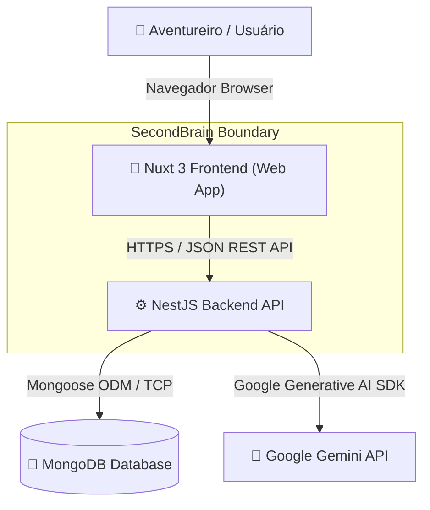
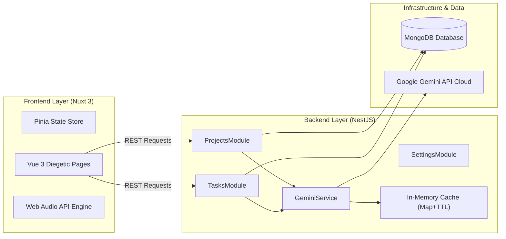

# 📐 Especificação Arquitetural e Visão de Sistema — SecondBrain

Documento central da arquitetura do **SecondBrain**, organizado segundo o padrão **C4 Model** (Context, Container, Component, Deployment) e diagramas de sequência comportamentais.

---

## 🗺️ Índice de Diagramas Arquiteturais

| Nível / Diagrama                | Descrição                                                       | Arquivo PlantUML                                                 |
| :------------------------------ | :-------------------------------------------------------------- | :--------------------------------------------------------------- |
| **C4 System Context**           | Visão geral do ecossistema SecondBrain e atores                 | [c4-system-context.puml](c4-system-context.puml)                 |
| **C4 Container**                | Divisão de contêineres (Frontend, NestJS, Mongo, Gemini, Cache) | [c4-container.puml](c4-container.puml)                           |
| **C4 Component (WBS Engine)**   | Mapeamento interno dos serviços de WBS, Catchball e Conversão   | [c4-component-wbs-planning.puml](c4-component-wbs-planning.puml) |
| **C4 Component (Diegetic UI)**  | Arquitetura em 3 camadas de UI RPG Diegética no Nuxt 3          | [c4-component-diegetic-ui.puml](c4-component-diegetic-ui.puml)   |
| **C4 Component (Graph RAG)**    | Camada de indexação e busca híbrida da LLM Wiki                 | [c4-component-graph-rag.puml](c4-component-graph-rag.puml)       |
| **C4 Deployment**               | Topologia física de infraestrutura, Docker e Nuxt/Nest runtime  | [c4-deployment.puml](c4-deployment.puml)                         |
| **Sequência: Tarefas**          | CRUD e alteração de estado de tarefas                           | [SequenceDiagramTask.puml](SequenceDiagramTask.puml)             |
| **Sequência: Planejamento WBS** | Fluxo completo Catchball → Objetivo SMART → WBS → Tarefas       | [SequenceDiagramProjectWBS.puml](SequenceDiagramProjectWBS.puml) |
| **Sequência: UI Diegética**     | Interação espacial, zoom de câmera e efeitos Web Audio API      | [SequenceDiagramDiegeticUI.puml](SequenceDiagramDiegeticUI.puml) |
| **Diagrama de Classes**         | Modelo estático de entidades e domínios do backend              | [ClassDiagram.puml](ClassDiagram.puml)                           |

---

## 🏛️ Visão Geral da Arquitetura C4

### Nível 1: C4 System Context

### Nível 2: C4 Container Architecture

---

## 🧩 Principais Sub-Sistemas e Decisões de Design

### 1. Engine de Planejamento e Decomposição WBS (`ProjectsModule`)

- **Conversa Catchball**: `PlanningService` conduz a troca de mensagens estratégicas com o usuário até atingir um objetivo SMART mensurável.
- **Decomposição em Árvore WBS**: `WBSService` consulta o Gemini em JSON Mode estrito, gerando os nós hierárquicos.
- **Validação de Regras de Negócio**: `WbsValidationService` garante a regra 8/80 (pacotes folha entre 8 e 80 horas de esforço estimado) e previne estouro de orçamento macro.
- **Conversão Automatizada**: `TaskConversionService` converte os nós folha da WBS em micro-tarefas com checklists padrão-ouro e estimativas PERT.

### 2. Arquitetura Diegética de UI em 3 Camadas (`Frontend`)

- **Camada 1 (Cenário Panorâmico)**: Imagem base ultra-otimizada WebP (`entrada-bg-clean.webp`) com elementos de iluminação GPU (`GuildVfxLayer.vue`) e sistema de partículas (`GuildParticlesCanvas.vue`).
- **Camada 2 (Mundo Interativo & Hotspots)**: Elementos diegéticos com hitboxes SVG (`GuildArchPortal.vue`), portas com animação por spritesheet de 9 frames (`GuildLibraryPortal.vue`) e overlay de profundidade (`chair.png` em `z-index: 5`).
- **Camada 3 (HUD & Modals Ancorados)**: Interface ancorada com `pointer-events: none` (`GuildTopBanner.vue`, `GuildMobileJournal.vue`) e modais integrados (`BookModal.vue` e `GuildReceptionDesk.vue`).

### 3. Engine de Consulta Semântica e Graph RAG (`AiWikiModule`)

- **Indexação de Grafo**: O script `scripts/index-wiki.ts` executa a análise AST via **Graphify**, salvando as relações em `graphify-out/graph.json`.
- **Busca Híbrida**: O controller `POST /ai/wiki-query` consulta simultaneamente os embeddings vetoriais de ADRs/READMEs e o grafo de dependências, enviando o contexto sintetizado para resposta do Gemini API.

---

## 🛠️ Como Visualizar e Editar os Diagramas PlantUML

Todos os arquivos `.puml` nesta pasta podem ser renderizados diretamente:

1. **Extensão para VS Code**: Instale a extensão oficial **PlantUML** (`jebbs.plantuml`).
2. **Atalho de Preview**: Abra qualquer arquivo `.puml` e pressione `Alt + D`.
3. **Exportação**: Para exportar em PNG ou SVG, pressione `F1` e selecione `PlantUML: Export Current Diagram`.
